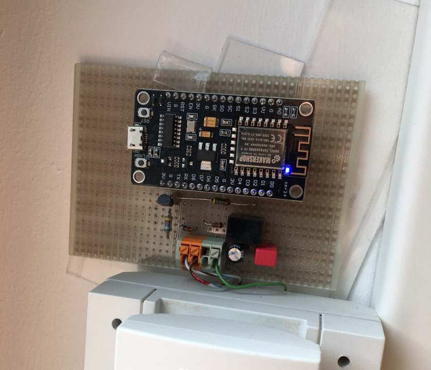
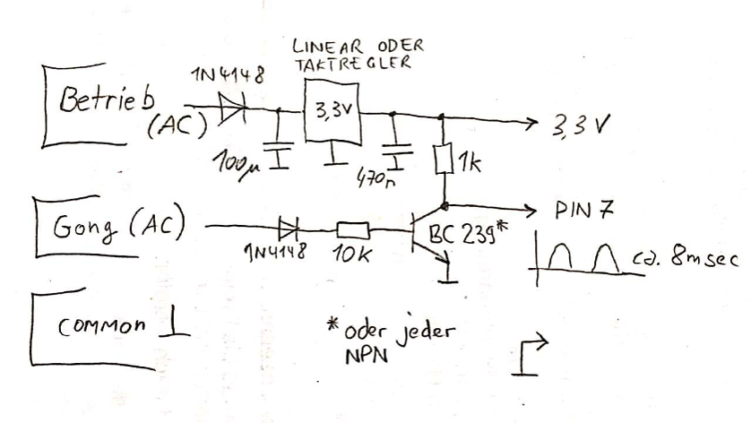

es-ifttt-doorbell
===========================================

# An ESP8266 IoT doorbell

This program sends a request to IFTTT to call your phone on GPIO input events.

To make a power supply directly from the doorbell wiring you have to rectify and
then step down the voltage as it is often 6 to 15 volts AC. You also have to
limit the bell signal to a 3.3V level, e.g. with a zener-diode.

Usage:

The esp-doorbell LED will fade on after a few seconds to notify its successful WiFi connection. If there is no configuration of if a connection error occurs then the LED will not light. The flash button can be pressed to start the WPS configuration mode. If WPS configuration was successful the LED should light after a few seconds. By holding the flash button for more than 3 seconds the currently active WiFi login credentials will be erased.

When the connected esp-doorbell is receiving a signal or an inverted signal, it will send a trigger request to an IFTTT event where you can throw in all the evil automation manifestations of your choosing. For example your cellphone could ring by combining [Maker Hooks](https://ifttt.com/maker_webhooks) with [VoipCalls](https://ifttt.com/voip_calls).

TLDR;
* LED IS ON - Connected to WiFi
* FLASH BUTTON - Starts WPS WIFI configuration
* HOLDING FLASH BUTTON (>3 seconds) - Erase WIFI credentials
* RECEIVING ANALOG SIGNAL - Calling you via IFTTT / doing other shenanigans
